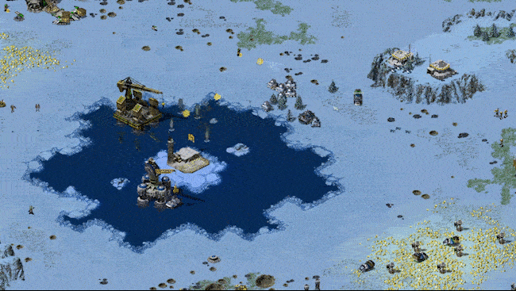

# ColdAI3rd
给玩家
------

欢迎使用冷场AI 3rd！如名字一样，这是冷场AI的第三版。然而，与前两版本不同，本版本是完全从零开始构建的。这样做可以避免原版AI脚本的干扰，更充分的控制AI的行为。尽管如此，第三版仍然保留了冷场AI前版本的一些特色，例如苏军rush、武矿一波流、骚扰矿车、铁幕蜘蛛、等等。

使用本AI，您需要准备一份可以正常运行的《命令与征服 红色警戒2：尤里的复仇》1.001版本（版本号可以查看游戏主菜单的右下角），将本压缩包（或文件夹）内的所有内容拷贝到尤里的复仇文件夹内（如果拷贝正确，则本文件应与Gamemd.exe文件处于同一目录下）。然后运行RunColdAI.bat，即可启动冷场AI。本压缩包内的所有文件均有用处，除非您清楚您要做什么，否则不应随意删除。考虑到当代操作系统运行尤里的复仇存在一定障碍，本AI附带了cnc-ddraw。若程序无法运行，或想调节显示设置，您可以打开 "cnc-ddraw config.exe" 进行调节。

冷场AI 3rd几乎没有对原版单位进行改动。考虑到玩家游戏的舒适度，本AI默认启用了“自动维修”功能。若想禁止，只需删掉AutoRepair.ini即可。

由于原版战役盟军第一关的奇怪触发，在使用本AI时，该关卡会出现卡关的现象。此外，本AI不保证与其他任何mod、地图、任务兼容。作者保证本AI不包含任何损害计算机系统的代码，作者也不对任何使用本AI所产生的后果负责。

给mod开发者
------

冷场AI 3rd几乎没有修改原版rulesmd.ini文件，仅在开头使用了Ares的[#include]功能。因此，本AI对基于此的mod开发十分友好。需要注意的是，本AI所使用的新增建筑紧跟着原版[BuildingTypes]注册，并且使用了许多利用该注册表顺序的AI脚本。因此您的mod不应注册或修改任何顺序小于等于423的建筑物的顺序或实际作用（例如，您应该始终保证第11号建筑是第二阵营的作战实验室）。

本AI的aimd.ini文件仅用于注册[#include]，因此，您甚至可以直接将该文件的内容合并到您已有的aimd.ini中。但是，作者更建议您完全基于本AI，二次开发您的AI。

本AI的artmd.ini文件相比于原版文件，仅修复了天启坦克的开火动画，以及增加了部分在作者的其他地图作品中用到的代码，以更好地兼容作者的其他作品。因此，您可以直接删除掉该artmd.ini文件，继续使用您已有的文件。

冷场AI 3rd的作者不会解答任何在二次开发中的问题，也不对其中产生的任何问题负责。

冷场AI 3rd使用MIT License，这意味着您可以随意地在您的mod、地图或其他任何作品中使用，而不必再征得作者的同意。但是您必须在您的作品的发布版中包含license_coldai3rd.txt文件（位于.\licenses\目录下）。需要注意的是，尽管MIT License允许将该本软件应用于商业软件中，但艺电公司明确表示，《命令与征服》系列的mod“不用于商业盈利”。因此尽管将本软件包含于商业软件的尝试不会侵犯作者的权利，却仍然会侵犯美国艺电公司（Electronic Arts）的权利。

版权声明
------

冷场AI 3rd使用了额外的库文件或软件，他们分别为：

*Ares （https://ares.strategy-x.com/）

*Phobos （https://github.com/Phobos-developers/Phobos）

*cnc-ddraw （https://github.com/CnCNet/cnc-ddraw）

相关软件的许可协议均包含在.\licenses\目录下。

                                                    Handama

                                                 2022年1月18日

截图
---------

